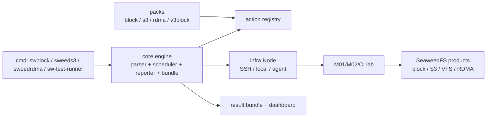

# Storage TestOps Platform

This repo is the shared scenario runner for SeaweedFS storage work. It should
stay product-facing and practical: run a scenario, collect evidence, publish a
clear pass/fail result.

## Mission

Use one runner to test storage products under real workflows:

- block: iSCSI/NVMe correctness, failover, soak, fio performance;
- VFS: mount read/write correctness, remount persistence, kernel/user-path perf;
- S3: bucket/object correctness, multipart/IAM/versioning, S3 perf;
- RDMA: object/VFS data path correctness, RC/DC performance, no silent fallback;
- comparisons: same workload, same units, same evidence bundle.

The runner is not a replacement for product tests. It is the orchestration and
evidence layer around them.

## Product Areas

| Area | Runner surface | What it proves |
| --- | --- | --- |
| Block | `swblock`, `packs/block`, `packs/v3block` | iSCSI/NVMe correctness, failover, soak, fio perf |
| S3 | `sweeds3`, `packs/s3` | bucket/object API correctness and S3 perf tools |
| VFS | core `exec` plus product scenarios | mount read/write correctness, remount persistence, perf |
| RDMA | `sweedrdma`, `packs/rdma` | M01/M02 hardware gate, RC/DC perf, VFS/object RDMA parity |

## SOP

Every release or PR gate follows the same loop:

1. **Pick the scenario**
   - Smoke: fast correctness check.
   - Gate: correctness plus required perf floors.
   - Soak: long-running stability with periodic metrics.
   - Fault: restart, partition, disk full, failover, recovery.

2. **Pin the product**
   - Pass `-env product_root=...` or `-env mono_ref=...`.
   - Record commit SHA and dirty state in the run bundle.
   - Never test an unknown installed binary.

3. **Run through the product entry**
   - `swblock` for block.
   - `sweeds3` for S3.
   - `sweedrdma` for RDMA.
   - `sw-test-runner` when a mixed suite needs all packs.

4. **Check correctness before performance**
   - SHA/MD5 match.
   - fresh remount/read-back where relevant.
   - no silent fallback.
   - negative controls when a path can lie.

5. **Record perf with stable labels**
   - bytes, requests, concurrency, object/file size;
   - throughput units (`MiB/s`, IOPS);
   - p50/p99 when available;
   - CPU/memory/counter snapshots when the product exposes them.

6. **Publish the bundle**
   - `manifest.json`: identity and metadata.
   - `status.json`: live status for dashboard.
   - `result.json`: machine-readable action results.
   - `result.xml`: CI/JUnit.
   - `result.html`: human review.
   - `artifacts/`: logs, bench JSON, screenshots, config.

7. **Keep the lab clean**
   - cleanup phase is `always: true`;
   - kill started processes;
   - unmount devices;
   - remove temp data;
   - assert zero residue when possible.

## Architecture



Design rules:

- core knows nothing about product internals;
- packs add product actions by registering shell/HTTP/gRPC wrappers;
- scenarios describe workflow, not Go code;
- evidence is written once in the run bundle and consumed by CI/dashboard;
- product-specific scripts can stay in product repos and be called by `exec`;
- the runner must stay stable while product code moves quickly.

## Interfaces

### Scenario YAML

The scenario is the public contract for a test:

```yaml
name: rdma-unified-lab-gate
timeout: 45m
metadata:
  product: seaweed-mono-rdma
  suite: rdma
env:
  mono_ref: main
topology:
  nodes:
    m01:
      host: 192.168.1.181
      user: testdev
      key: "{{ ssh_key }}"
phases:
  - name: test
    actions:
      - action: rdma_run_mono_gate
        node: m01
        ref: "{{ mono_ref }}"
```

Required fields for serious gates:

- `metadata.product`
- `metadata.suite`
- `metadata.test_id`
- `timeout`
- `topology.nodes`
- at least one correctness assertion phase
- `cleanup` phase when the scenario starts daemons or mounts devices

### Action Interface

Go action shape:

```go
func(ctx context.Context, actx *ActionContext, act Action) (map[string]string, error)
```

Rules:

- return an error for FAIL;
- return `map[string]string{"value": "..."}`
  when `save_as` should capture a primary value;
- return `__name` keys for internal vars used by later phases;
- do not import daemon internals;
- call product through shell, HTTP, gRPC, CLI, or existing product scripts;
- parse stable witness lines, not log prose.

### Result Interface

Downstream CI/dashboard should depend only on:

- `manifest.json`
- `status.json`
- `result.json`
- `result.xml`
- `artifacts/`

Stable result keys should use product prefixes:

```text
__rdma_perf_rc_push_mib_s
__rdma_perf_rc_pull_mib_s
__rdma_perf_dc_push_mib_s
__rdma_loader_rows
```

Do not scrape terminal colors or human-only paragraphs.

## Perf and Comparison Rules

Performance numbers are only comparable when these match:

- same payload size;
- same request count;
- same concurrency;
- same source data path;
- same destination semantics;
- same cache state or explicitly labeled warm/cold;
- same units.

For competitor/product comparison, the scenario must name:

- product under test;
- version/commit;
- hardware;
- network link;
- storage backend;
- workload generator;
- acceptance floor or regression threshold.

If those are not controlled, record the number as diagnostic only.

## Result Contract

Every serious gate should emit:

- product commit and dirty state;
- exact scenario name and run id;
- correctness witnesses: SHA/MD5 match, remount/read-back, no silent fallback;
- perf rows with stable labels and units;
- logs or artifact path for failed daemon/processes;
- explicit non-claims when a row is unsupported.

## Current RDMA Entry

```bash
sweedrdma validate scenarios/rdma-unified-lab-gate.yaml
sweedrdma run scenarios/rdma-unified-lab-gate.yaml \
  -env mono_ref=rdma/lab-gate-runner-tools \
  -meta project=rdma -meta run_by=$USER
```

The RDMA scenario calls the existing M01/M02 lab runner and records the normal
TestOps bundle/dashboard result. It checks object RC push, RC pull, DC push,
VFS read/write correctness, and loader matrix rows.

For team-visible CI-style runs on M01, use the wrapper so metadata, shared
results, and bundle validation are consistent:

```bash
TESTOPS_MONO_REF=main ./scripts/run-rdma-ci.sh
```

The wrapper writes to `/mnt/smb/work/share/testops/results/rdma-ci`, tags the
run with `project/team/run_by/test_id/branch/commit`, validates the completed
bundle, and points reviewers at the dashboard.

Current accepted RDMA gate shape:

| Row | Meaning | Floor |
| --- | --- | --- |
| `rc_push_mib_s` | object read via RC push | `>= 5120 MiB/s` |
| `rc_pull_mib_s` | object read via RC pull | diagnostic today |
| `dc_push_mib_s` | object read via DC push | `>= 5120 MiB/s` |
| `loader_rows` | object loader matrix rows | `> 8` |

## Roadmap

1. Keep block gates as the stability baseline.
2. Add S3 perf scenarios with standard tools such as warp or s3-benchmark.
3. Move VFS read/write smoke and perf gates into product scenarios.
4. Keep RDMA hardware and software-RDMA gates as release blockers for RDMA PRs.
5. Add comparison baselines against external products only when the workload and
   units are identical and reproducible.

For the platform direction beyond individual gates, see
[TestOps Control Plane Roadmap](testops-control-plane-roadmap.md): M01 CI,
SSH/agent execution, binary stores, shared dashboard tracking, future UI, and
SiteOps mode.
