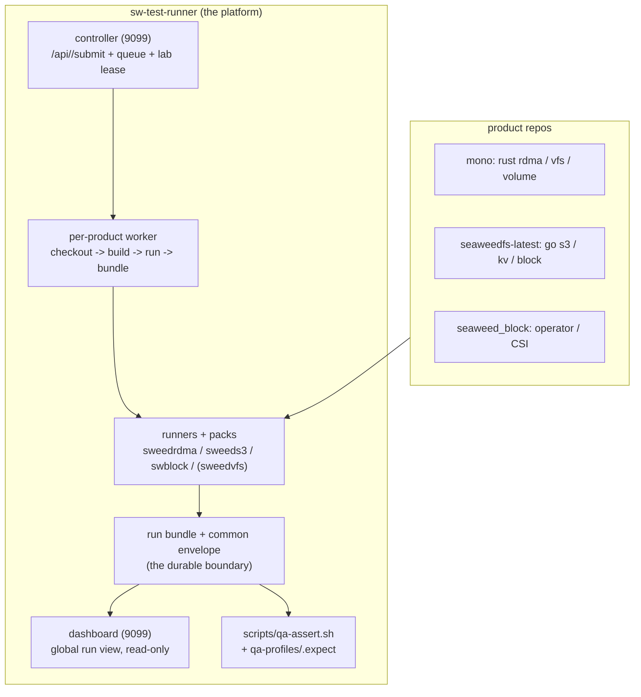

# Unified TestOps Platform

One TestOps / CI/CD / ProdOps platform for **all** SeaweedFS storage products —
block, S3, VFS, RDMA, KV — even though they live in different repos and languages.
Products differ in scenario, worker, and metrics; they share the **entry, the
bundle contract, and the acceptance assertion**.

This is the "start here" overview. Depth lives in:

- [Control-Plane Product Contract](control-plane-product-contract.md) — the normative plug-in interface.
- [TestOps Control Plane Roadmap](testops-control-plane-roadmap.md) — the phased platform build-out.
- [Storage TestOps Platform](storage-testops-platform.md) — surfaces, SOP, scenario/action/result interfaces.
- [NIXL and KVCache Testbed Plan](nixl-kvcache-testbed.md) — the next RDMA/NIXL/KVCache gates.
- [QA Bundle Assert](qa-bundle-assert.md) + `scripts/qa-assert.sh` — the one acceptance check.

---

## 1. Where products live vs where the platform lives

| Repo | Holds | Products |
|---|---|---|
| `C:\work\rdma\seaweed-mono-rdma-refresh` (Rust + Go enterprise) | `enterprise/rust/{sw-rdma, sw-rdma-loader, sw-rdma-object, sw-rdma-vfs, volume-server}`, `seaweed-vfs` | **RDMA, VFS** |
| `C:\work\seaweedfs-latest` (Go core) | `weed/` (s3, filer, kv, mount, volume) | **S3, KV, block (go paths)** |
| `C:\work\seaweed_block` (operator/CSI) | operator-status, lifecycle-owner, CSI, iSCSI/NVMe | **block (k8s/CSI)** |
| **`artifactory/testops` (this repo)** | core engine, packs, runners, controller, dashboard, qa-assert | **the platform** |

Products stay in their repos and move fast. The platform is the stable
orchestration + evidence layer around them.

---

## 2. Structure



The **durable boundary is the bundle contract** (§4). UI, controller, worker, CI,
and AI all build around it instead of replacing it.

---

## 3. The one entry point

**`http://192.168.1.181:9099/`** (M01) — dashboard + suite controller.

```bash
# submit a reviewable ref for any registered+enabled suite
POST /api/<suite>/submit   { ref, scenario, run_by, team, test_id }
GET  /api/controller/status?suite=<suite>          # queue/running/done/failed
# watch
http://192.168.1.181:9099/?project=<suite>-ci
```

The controller is safe: the UI submits a **scenario + controlled parameters**; it
writes ONE request file to `queue/<project>`; a per-product **worker** owns
execution + the lab lease. No shell from the UI. **All four suites — `rdma`,
`s3`, `block`, `vfs` — have a worker**, so any of them can be submitted from
9099 (e.g. `POST /api/s3/submit {"ref":"master"}`). The workers on M01
(`testops-{rdma,vfs,block,s3}-ci-worker.service`) share the same generic
`testops-ci-worker.sh` + the same `qa-assert.sh`, and serialize on one lab lease.
A CLI run of the same scenario produces the same bundle — the interim before a
worker, still valid for local debug.

---

## 4. The shared SOP (every product, every gate)

```text
pick scenario -> submit ref -> worker: checkout+build+run -> bundle
   -> qa-assert (envelope + product floors) -> ACCEPT / REJECT
```

**Three paths, identical across products** (see the per-product runbooks):

| Path | Project | Use | Verdict |
|---|---|---|---|
| Standard gate | `<suite>-ci` | reviewable branch/SHA | ACCEPT / REJECT |
| Adhoc dirty | `<suite>-dev` | local uncommitted build | DEBUG ONLY, never ACCEPT |
| Deep runbook | — | specialty failure root-cause | specialty evidence |

**Common envelope** every gate emits (via the `emit_provenance` action) into
`result.json` `vars`, product rows layered on top:

```text
__product  __gate_pass  __gate_status  __tested_ref  __tested_sha  __lab_run_id
__<product>_...  (perf / correctness rows)
```

**One acceptance check** for all products:

```bash
scripts/qa-assert.sh <bundle> --ref <requested> --profile docs/qa-profiles/<product>.expect
# -> QA_BUNDLE_ASSERT_OK  (or QA_BUNDLE_ASSERT_FAIL: <reason>)
```

`qa-assert.sh` reads the un-prefixed envelope AND legacy `__<product>_*` keys, so
older bundles pass unchanged.

---

## 4a. Data models, access methods, transports (taxonomy)

Not everything called a "product" is a distinct data model. SeaweedFS keeps **one
object/KV dataset** (the filer namespace over volume needles); **S3, VFS, and
raw-KV are three access methods over that same data**, and http/rc/dc/rdma are
transports:

- **Data models (2):** **object/KV** (the filer / volume namespace) and **block**
  (iSCSI/NVMe LUN — a genuinely separate model, not the filer).
- **Access methods over object/KV:** **S3** (HTTP object API), **VFS** (POSIX
  mount), **raw-KV**.
- **Transports:** `http` / `rc` / `dc` / `rdma` — the RDMA object path is
  S3-shaped `GET`(Range)/`PUT` + `x-rdma-info`; drop it and it's a normal S3
  request.

So "RDMA / S3 / KV" are not separate products — they're access×transport points on
the one object/KV dataset (the RDMA unified gate already runs the matrix; the S3
chain is the `s3 × http` point). **VFS is also an access method over that same
data** — its signature gate is **cross-access**: write via S3, read via a VFS
mount (and back), proving **one dataset consumed two ways**. VFS's extra
requirement is the **M01 mount** (stateful FUSE/kernel), which is why it needs a
standalone gate instead of riding the object HTTP path. Only **block** is a
separate data model.

## 5. Product status — 4/4 fully wired

The four CI **suites** are operational units (one worker + one gate + one project
each). Conceptually (§4a) `rdma` and `s3` are two access×transport points on the
one **object/KV** dataset; `vfs` is a third access method (POSIX mount) over that
same data; `block` is a separate data model (LUN).

| Suite | Runner + pack | Gate scenario | 9099 worker | Envelope | qa-profile | Project | Status |
|---|---|---|---|---|---|---|---|
| **rdma** — object/KV over RC/DC | `sweedrdma` / `packs/rdma` | `rdma-unified-lab-gate` | ✅ | ✅ (rdma-prefixed, bridged) | `rdma.expect` | `rdma-ci` | ✅ **full reference** |
| **s3** — object/KV over HTTP | `sweeds3` / `packs/s3` | `s3-smoke-chain` | ✅ | ✅ `emit_provenance` | `s3.expect` | `s3-ci` | ✅ **full** |
| **block** — iSCSI/NVMe LUN | `swblock` / `packs/block`,`v3block` | `helm-single-node-first-volume` | ✅ (SMB harness → product_root) | ✅ `emit_provenance` | `block.expect` | `block-ci` | ✅ **full** (published image) |
| **vfs** — POSIX mount over object/KV | `sweeds3` + FUSE mount | `vfs-cross-access-chain` | ✅ (M01 mount, root) | ✅ `emit_provenance` | `vfs.expect` | `vfs-ci` | ✅ **full** — proves **S3↔VFS shared data** |

Every suite: `POST /api/<suite>/submit` → generic worker → gate emits the common
envelope → **same `qa-assert.sh --profile <suite>.expect` → `QA_BUNDLE_ASSERT_OK`**
→ dashboard. Verified end-to-end for all four (2026-07-01).

**Shared by all:** the one controller/dashboard, the generic `testops-ci-worker.sh`
(one per suite, shared lab lease), `emit_provenance` + the common envelope,
`qa-assert.sh`, run metadata, and SMB result roots. **Remaining polish:** raw-KV +
more transport matrix rows under object/KV; a VFS mount lease distinct from the
shared lab lock; the block SMB harness is a snapshot (refresh when the seaweed_block
scenario/scripts/charts change).

---

## 6. How a new product onboards

Implement the five contract items ([Control-Plane Product Contract §2](control-plane-product-contract.md)).
**S3 is the worked, minimal reference** — copy its shape, not RDMA's details.

1. **Runner + pack** — `cmd/sweed<product>` + `packs/<product>` (or reuse an
   existing runner). Register core + your pack.
2. **Unified gate scenario** — `scenarios/<product>-…-chain.yaml`: build → seed →
   test → cleanup, self-contained, zero-residue. At the end of a **passing** test,
   emit the envelope with one action:
   ```yaml
   - action: emit_provenance
     product: <product>
     tested_ref: "{{ ref }}"
     tested_sha: "{{ built_sha }}"     # stamped by build, NOT runner-cwd git
     __<product>_<row>: "{{ value }}"  # product perf/correctness rows
   ```
3. **qa-profile** — `docs/qa-profiles/<product>.expect`: the product floors
   (`__<product>_x>=n`, `__<product>_y=1`). The envelope is checked by the script.
4. **Result project** — write to `results/<product>-qa` (dev to `<product>-dev`);
   pass `-meta project=<product>-qa team=… run_by=… test_id=… branch=… commit=…`.
5. **Worker adapter** (for 9099 submit) — register a suite
   `{scenarios-allowlist, ci_project, dev_project, lock, runner}` and ship a
   `<product>-ci-worker` (watch `queue/<project>` → lease → build+stamp
   `__tested_sha` → run → move done/failed). Until then, run via the CLI.

**Verify:** `runner run <scenario> -results-dir results/<product>-qa -meta …` →
bundle on the dashboard → `qa-assert.sh <bundle> --ref <ref> --profile
docs/qa-profiles/<product>.expect` → `QA_BUNDLE_ASSERT_OK`.

Onboarding is done when your gate emits the envelope, `qa-assert` accepts the
bundle, and (for full CI) the suite worker lets it submit through 9099 like RDMA.

---

## 7. Doc map

| Doc | For |
|---|---|
| this | the overview + product status + onboarding SOP |
| [control-plane-product-contract.md](control-plane-product-contract.md) | the normative plug-in interface + suite wire spec |
| [testops-control-plane-roadmap.md](testops-control-plane-roadmap.md) | the phased platform roadmap (controller, binary store, agent, SiteOps) |
| [storage-testops-platform.md](storage-testops-platform.md) | surfaces, SOP, scenario/action/result interfaces |
| [qa-bundle-assert.md](qa-bundle-assert.md) | `qa-assert.sh` usage + profiles |
| product runbooks | RDMA `QA-RUNBOOK-rdma-current-v2.md`, block `QA-RUNBOOK-block-current-v1.md`, and the per-suite runbooks as they land |
