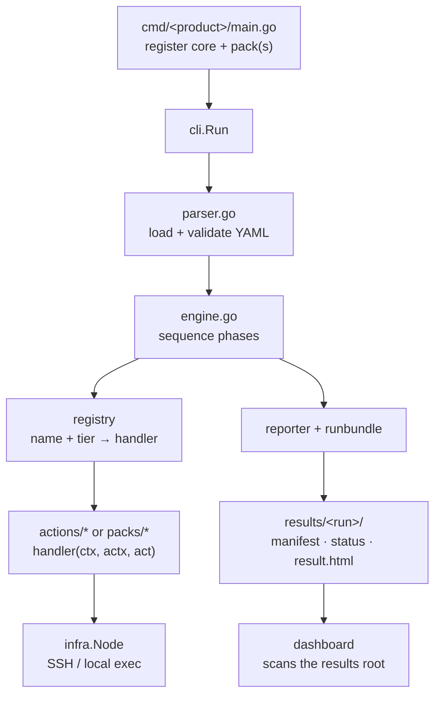

# Code Map

Where things live, and how a scenario flows through the code.

## Layout

| Path | Package | Role |
|---|---|---|
| `*.go` (repo root) | `testrunner` | The **product-agnostic core**: scenario engine, parser, registry, reporting, run bundles, distributed coordination. |
| `actions/` | `actions` | Cross-product **action handlers** grouped by tier (system, fault/chaos, io, iscsi, nvme, k8s, metrics, build, devops, results). |
| `packs/` | per pack | **Per-product action plugins** — `block`, `kv`, `s3`, `v1weed`, `v3block`. Each exposes `RegisterPack(r *tr.Registry)`. |
| `cmd/` | `main` | **Per-product binaries** (see [Packs & Binaries](packs-and-binaries.md)). |
| `cli/` | `cli` | Shared CLI dispatch (`run`, `list`, `validate`, `status`, `list-runs`, `cancel`, `console`). |
| `infra/` | `infra` | Node abstraction (`Node` = SSH or local exec), daemon/target lifecycle, iSCSI client, artifact collection. |
| `internal/blockapi/` | `blockapi` | V2 block master REST client (internal). |
| `scenarios/` | — | YAML scenarios (see [Scenario Catalog](scenario-catalog.md)). |
| `docs/` | — | This documentation set (rendered by the wiki and the dashboard). |

## Core files (repo root)

| File | Role |
|---|---|
| `engine.go` | Sequences a scenario: phases → actions, parallelism, delays, var substitution. |
| `parser.go` | Parses + validates scenario YAML into the scenario model. |
| `registry.go` | Action registry; `RegisterFunc(name, tier, handler)`; tier constants (`core`, `block`, `devops`, `chaos`). |
| `types.go` | Shared types: `ActionContext`, `Action`, `Phase`, scenario model. |
| `reporter.go`, `reporter_html.go`, `baseline.go` | JUnit XML, `result.html`, regression baselines. |
| `runbundle.go`, `runstatus.go` | The on-disk bundle (`manifest.json`, `status.json`) and live status writer. |
| `coordinator.go`, `agent.go`, `cluster_manager.go` | Distributed multi-node control plane. |
| `console.go`, `metrics.go`, `bundlevalidate.go` | Console web UI, Prometheus scraping, bundle validation. |

## How a run flows



See [How It Works](how-it-works.md) for the full sequence + component diagrams.

## Action handler shape

```go
func myAction(ctx context.Context, actx *tr.ActionContext, act tr.Action) (map[string]string, error) {
    node := actions.GetNode(actx, act.Node)         // resolve target node
    out, _, code, err := node.Run(ctx, "some cmd")  // run remotely/locally
    _ = act.Params["x"]; _ = actx.Vars["y"]         // params + run vars
    actx.Log("did the thing")
    return map[string]string{"saved": out}, err     // SaveAs-able outputs
}
// registered in RegisterPack: r.RegisterFunc("my_action", tr.TierBlock, myAction)
```

See [Packs & Binaries](packs-and-binaries.md) for adding a new product pack.
