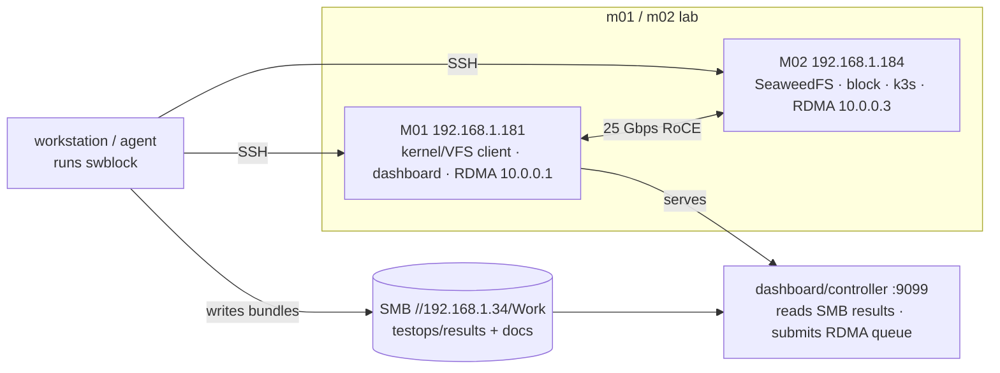

# Deploy & Operate

How the runner and dashboard are built and run on the shared lab.

## Build the binaries

```bash
make build               # every cmd/ binary into ./bin
make build-swblock       # just one
go test ./... -count=1   # unit tests
```

Each binary is `core + chosen packs` ([Packs & Binaries](packs-and-binaries.md)).
The runner itself needs no install on the lab — you run it from your workstation
and it drives the nodes over SSH.

## Lab topology



The runner writes each run **bundle** to the shared SMB results root; the
dashboard on M01 reads that root. Bundles live on SMB, **not** on m01/m02 local
disk.

## Nodes (how the runner reaches machines)

A scenario's `topology.nodes` maps a name to a machine; actions target a node by
name and the runner runs the command there via **`infra.Node`** (SSH or local):

```yaml
topology:
  nodes:
    m02: { host: 192.168.1.184, user: testdev, key: ~/.ssh/testdev_key }
    m01: { host: 192.168.1.181, user: testdev, key: ~/.ssh/testdev_key, alt_ips: [10.0.0.1] }
```

```bash
swblock run <scenario> -results-dir /mnt/smb/work/share/testops/results/<project>
```

## Dashboard (systemd on M01)

The [dashboard](dashboard.md) runs as a systemd service so it survives reboots.
The result-browser part is read-only. When `-controller` is set, the same
service also exposes the RDMA queue submit/status panel:

```ini
# /etc/systemd/system/testops-dashboard.service
[Service]
User=testdev
ExecStart=/usr/local/bin/testops-dashboard \
  -root /mnt/smb/work/share/testops/results \
  -docs /mnt/smb/work/share/testops/docs \
  -controller \
  -controller-queue /mnt/smb/work/share/testops/queue/rdma-ci \
  -controller-state /mnt/smb/work/share/testops/state/rdma-ci \
  -controller-logs /mnt/smb/work/share/testops/logs/rdma-ci \
  -port 9099
Restart=always
```

```bash
sudo systemctl enable --now testops-dashboard
# redeploy a new build (install -m 755 keeps the exec bit; plain cp drops it → 203/EXEC):
sudo install -m 755 testops-dashboard /usr/local/bin/testops-dashboard
sudo systemctl restart testops-dashboard
```

## Controller-Lite (M01 RDMA CI)

M01 runs a small file-queue worker for RDMA gates. The worker is the only process
that executes the gate; it takes the lab lock and calls `scripts/run-rdma-ci.sh`.

```bash
# Submit a run request.
TESTOPS_MONO_REF=main ./scripts/testops-ci-submit.sh

# Process one request, useful for manual validation.
./scripts/testops-ci-worker.sh --once

# Or run continuously under systemd/cron.
TESTOPS_POLL_SECONDS=10 ./scripts/testops-ci-worker.sh
```

The worker:

- reads requests from `/mnt/smb/work/share/testops/queue/rdma-ci`;
- takes one lab lock at `/mnt/smb/work/share/testops/locks/rdma-lab.lock`;
- calls `scripts/run-rdma-ci.sh`;
- writes result bundles to `/mnt/smb/work/share/testops/results/rdma-ci`;
- moves requests to `state/rdma-ci/done` or `state/rdma-ci/failed`;
- writes request status JSON under `state/rdma-ci/status`;
- updates `state/rdma-ci/status/last-run.json`;
- writes logs under `/mnt/smb/work/share/testops/logs/rdma-ci`.

### All four suites (rdma / s3 / block / vfs)

The same generic `testops-ci-worker.sh` runs once **per suite** on M01, differing
only by env (`TESTOPS_QUEUE_DIR`, `TESTOPS_RESULTS_DIR`, `TESTOPS_LOCK_FILE`,
`TESTOPS_RDMA_CI_SCRIPT`). All four are deployed + enabled:

| Service | Queue | Run script | Project |
|---|---|---|---|
| `testops-rdma-ci-worker` | `queue/rdma-ci` | `run-rdma-ci.sh` | `rdma-ci` |
| `testops-s3-ci-worker` | `queue/s3-ci` | `run-s3-ci.sh` | `s3-ci` |
| `testops-block-ci-worker` | `queue/block-ci` | `run-block-ci.sh` | `block-ci` |
| `testops-vfs-ci-worker` | `queue/vfs-ci` | `run-vfs-ci.sh` | `vfs-ci` |

They share one lab lease (`locks/rdma-lab.lock`) so lab gates serialize. Submit any
via `POST /api/<suite>/submit`. rdma/s3/vfs are self-contained in this repo; block's
run script stages its harness (scenario + scripts + charts) from SMB into
product_root on m02 (the block gate lives in the seaweed_block repo).

On M01 the wrapper defaults to `TESTOPS_SSH_KEY=/home/testdev/.ssh/id_ed25519`
so the scenario can SSH back into M01. Override `TESTOPS_SSH_KEY` when running
from another controller host.

Optional notifications:

```bash
# Send mail when a queued request finishes, if /usr/bin/mail is configured.
TESTOPS_NOTIFY_EMAIL=dev@example.com ./scripts/testops-ci-worker.sh

# Or call a custom hook. The worker exports TESTOPS_NOTIFY_STATE,
# TESTOPS_NOTIFY_REQUEST_ID, TESTOPS_NOTIFY_LOG, TESTOPS_NOTIFY_BUNDLE,
# TESTOPS_NOTIFY_SUBJECT, and TESTOPS_NOTIFY_BODY.
TESTOPS_NOTIFY_CMD='printf "%s\n" "$TESTOPS_NOTIFY_BODY" >> /tmp/testops-notify.log' \
  ./scripts/testops-ci-worker.sh
```

This is intentionally smaller than the future controller. It proves the team
workflow first: safe trigger, serialized lab use, dashboard-visible evidence.

## Controller Web/API

The preferred setup is one URL: `testops-dashboard -controller` on port 9099.
It shows historical result bundles and a small suite submit/status panel on the
same page. It does not run shell commands and does not replace the worker. A
submit request only writes one `.env` file under the selected suite queue.

```bash
testops-dashboard \
  -root /mnt/smb/work/share/testops/results \
  -docs /mnt/smb/work/share/testops/docs \
  -controller \
  -controller-queue-root /mnt/smb/work/share/testops/queue \
  -controller-state-root /mnt/smb/work/share/testops/state \
  -controller-log-root /mnt/smb/work/share/testops/logs \
  -port 9099
```

Systemd example:

```ini
# /etc/systemd/system/testops-controller.service
[Service]
User=testdev
WorkingDirectory=/opt/rdma-lab-ci/sw-test-runner
Environment=TESTOPS_CONTROLLER_TOKEN=
ExecStart=/usr/local/bin/testops-controller \
  -queue /mnt/smb/work/share/testops/queue/rdma-ci \
  -state /mnt/smb/work/share/testops/state/rdma-ci \
  -logs /mnt/smb/work/share/testops/logs/rdma-ci \
  -dashboard http://192.168.1.181:9099/ \
  -port 9109
Restart=always
```

Optional submit token:

```bash
TESTOPS_CONTROLLER_TOKEN=<token> testops-dashboard -controller -port 9099
```

Submit by API:

```bash
curl -X POST http://m01:9099/api/rdma/submit \
  -H 'Content-Type: application/json' \
  -H 'X-TestOps-Token: <token>' \
  -d '{"mono_ref":"rdma/my-branch","run_by":"dev-agent"}'
```

Check status:

```bash
curl http://m01:9099/api/controller/status?suite=rdma
curl http://m01:9099/api/controller/status?suite=block
```

The legacy `-controller-queue`, `-controller-state`, and `-controller-logs`
flags are still accepted as RDMA-only overrides. New deployments should use the
root flags above so one service can expose multiple suites.

If you want a separate submitter process, `testops-controller` can still run on
9109 with the same queue/state paths. The normal M01 setup should use the merged
9099 dashboard/controller to avoid two URLs.

## Disk hygiene

A weekly **`testops-janitor`** systemd timer on M01 + M02 prunes docker dangling
images and deletes stale `/tmp/sra-*` / `/tmp/mono-*` residue older than 7 days:

```bash
journalctl -u testops-janitor        # what it cleaned
sudo systemctl start testops-janitor.service   # run now
```

Edit `RESIDUE_GLOBS` / `RETAIN_DAYS` in `/usr/local/bin/testops-janitor.sh` to
tune it. If scenarios honor `cleanup`, the janitor rarely has anything to do.
