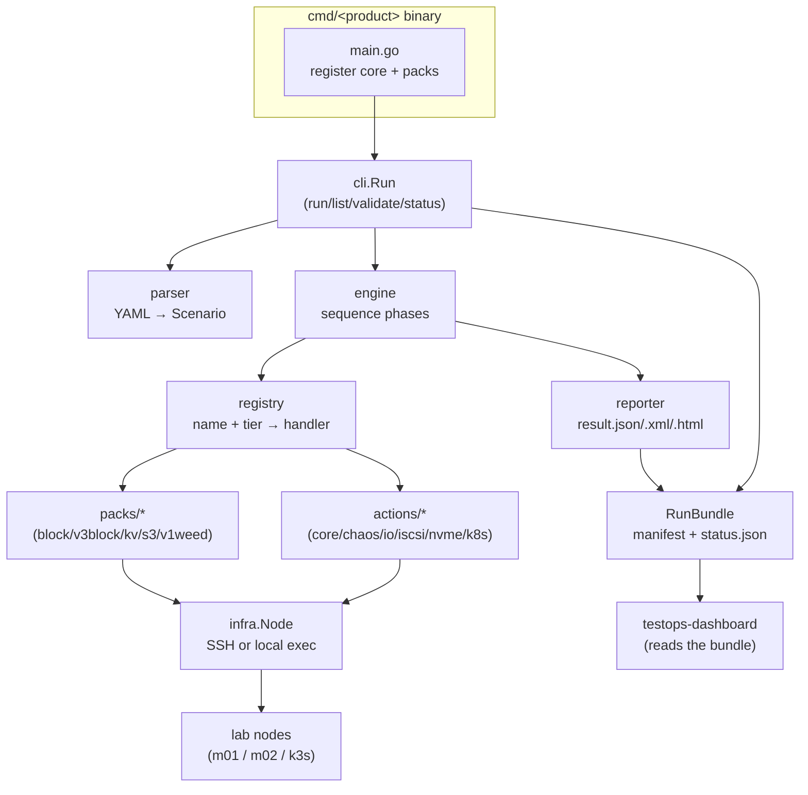
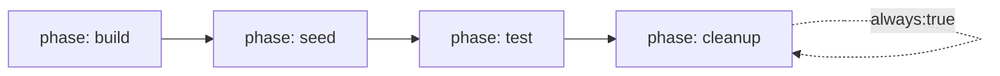

# How It Works

sw-test-runner is **one product-agnostic core** plus **per-product packs**, shipped
as **per-product binaries**. The core knows how to parse a scenario, sequence its
phases, dispatch actions to nodes, and write a result bundle. A pack teaches it
the actions for one product (block, S3, KV, …). A binary is `core + chosen packs`.

## The pieces



## A run, end to end

```mermaid
sequenceDiagram
  participant U as operator
  participant C as cli.Run
  participant P as parser
  participant B as RunBundle
  participant E as engine
  participant R as registry
  participant H as action handler
  participant N as infra.Node
  U->>C: run scenario.yaml -env/-meta -results-dir
  C->>P: parse + validate YAML
  C->>B: CreateRunBundle (manifest.json, status.json, frozen scenario)
  C->>E: execute(scenario, bundle)
  loop each phase
    loop each action
      E->>R: lookup(action.name, tier)
      R->>H: handler(ctx, actx, action)
      H->>N: node.Run(cmd) over SSH/local
      N-->>H: stdout, stderr, exit code
      H-->>E: map[string]string (save_as), error
      E->>B: status.json (phase/state progress)
    end
  end
  E->>B: Finalize → result.json/.xml/.html, provenance.json
  B-->>U: results/&lt;run&gt;/ bundle (+ dashboard picks it up)
```

## Registry & tiers

Every action is registered with a **name** and a **tier**:

```go
r.RegisterFunc("dd_write", tr.TierBlock, ddWrite)
```

Tiers (`core`, `block`, `devops`, `chaos`, `k8s`, plus pack tiers like `s3`) let
`list` group actions and let `run -tiers core,block` scope what's allowed. A
binary only knows the actions its packs registered — see
[Packs & Binaries](packs-and-binaries.md).

## Phases

A scenario is an ordered list of **phases**; each phase is a list of **actions**.



- **sequential by default**; `parallel: true` runs a phase's actions concurrently.
- `repeat: N` + `aggregate: median|mean` runs a phase N times for perf sampling
  (`trim_pct` trims outliers).
- `always: true` runs the phase even if an earlier one failed — this is how
  `cleanup` guarantees zero residue (see [Run Lifecycle](lifecycle.md)).
- `include:` pulls phases from another file with `include_params:` overrides, for
  reuse.

## Variables

A flat variable namespace flows through `{{ name }}` substitution:

- `env:` in the scenario (overridable per run with `-env KEY=VALUE`).
- `save_as:` on an action captures its output into a var for later actions.
- the runner injects `run_id`, `bundle_dir`, `artifacts_dir` so phases route their
  artifacts into the bundle.

## Live status

While a run executes, the core writes **`status.json`** (state =
queued/running/pass/fail, current_phase, phases_done/total). `swblock status` and
the [dashboard](dashboard.md) read it — that's how progress shows up without
parsing logs. `manifest.json` carries identity + `metadata` (test_id, project,
run_by, team); `result.*` and `provenance.json` are written at Finalize.

## Distributed mode (optional)

For multi-node orchestration the core has a **coordinator/agent** layer
(`coordinator.go`, `agent.go`): nodes mapped to `agents:` in the topology are
driven by a coordinator instead of direct SSH. Single-node SSH/local is the
default; reach for coordinator mode only when a scenario must fan out across many
machines.
