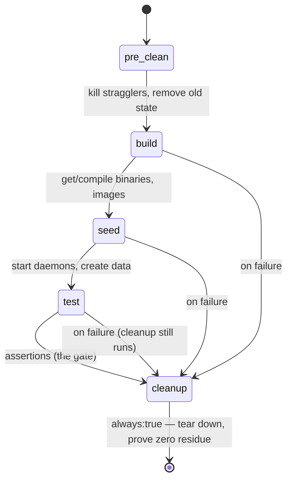
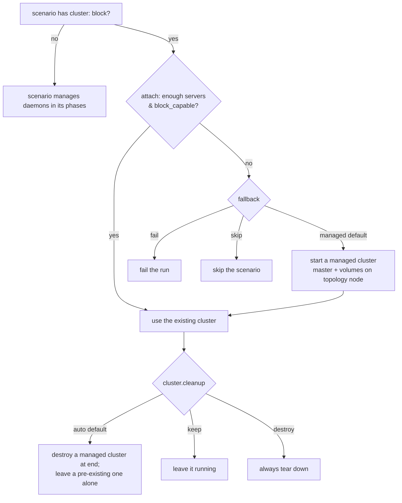

# Run Lifecycle & Cleanup

Every scenario follows the same contract: **build → seed → test → cleanup**,
self-contained, zero-residue. Run it on a clean lab and it leaves the lab clean.



## The four phases

| Phase | Does | Key actions |
|---|---|---|
| **build** | get the bits — `git clone` + compile, or build/import images | `exec`, `build_*`, `docker_*` |
| **seed** | bring up daemons + create the data under test | `*_start_stack`, `iscsi_login`, `mkfs`, `*_make_bucket` |
| **test** | the actual gate — do I/O, assert outcomes | `dd`, `*_verify_roundtrip`, `assert_*`, `metrics_*` |
| **cleanup** | tear everything down, assert nothing is left | `*_stop_stack`, `umount`, `assert_no_processes` — with `always: true` |

`cleanup` carries **`always: true`** so it runs even when `test` fails — that's
what makes a scenario safe to re-run and safe to share a lab.

## Controlling the cluster

A scenario can manage its own daemons phase-by-phase, **or** declare a `cluster:`
block and let the runner attach to an existing cluster (and optionally create one
if attach fails):



```yaml
cluster:
  require: { servers: 2, block_capable: 1 }
  fallback: managed         # managed (default) | fail | skip
  cleanup: auto             # auto (default) | keep | destroy
  managed:
    master_port: 9333
    node: m02
    volumes:
      - { port: 8080, block_listen: ":3350" }
```

If you omit `cluster:`, the scenario owns the daemon lifecycle in its own phases —
which is what most current public scenarios do.

## Cleanup discipline (shared lab)

The lab is shared by multiple agents/teams, so cleanup must be **scoped**, never
global:

- **`cleanup` is `always: true`** and proves zero residue (e.g.
  `assert_no_processes`, `pgrep … | wc -l == 0`).
- **Never** bare `pkill -f weed` — it kills other people's runs. Kill only your
  own run's PIDs / namespace.
- Use **per-project results dirs** and **per-project ports**; take a **lease** for
  singletons (the k3s cluster, the M01 kernel module, an RDMA port). See the
  [Standard](../cross-product-testops-standard.md) §7c.
- A weekly **janitor** backstops failed-run residue on m01/m02 (see
  [Deploy & Operate](deploy.md#disk-hygiene)) — but a well-behaved scenario never
  needs it.
